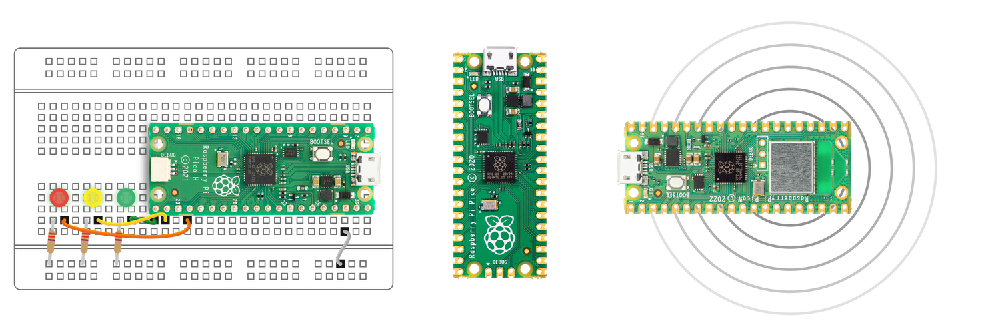
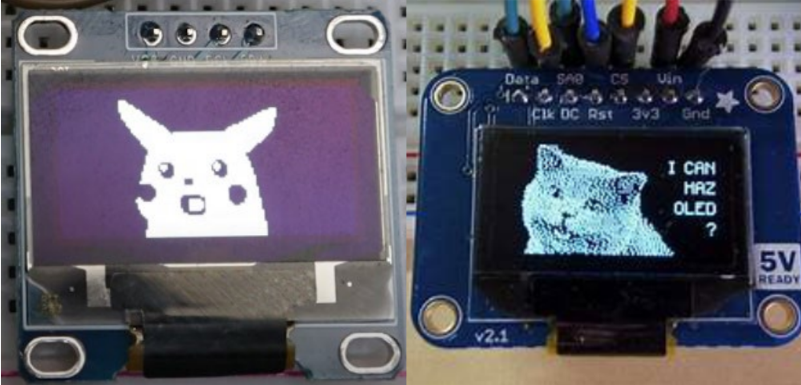

# Executive Summary
This project course introduces students to hands-on Computer Engineering (CENG) projects through the Pico platform. Students learn fundamentals of embedded systems, sensors, and wireless communication while designing small-scale prototypes that integrate hardware and software. The course emphasizes practical experimentation, teamwork, and iterative design—preparing students for advanced VIP and capstone projects in automation, robotics, and intelligent sensing systems.

# Logistics {#logistics}
- **CRN**
| Semester    | ECE 196   |  ECE 296 |
| ---         | ---       |  ---     |
| Spring 2026 | 86916     |  86945   |

- **Personnel**
| Advisor                                                                                                                          | Office Hours                |
| ----                                                                                                                             | ---                         |
|  Email yao.zheng@hawaii.edu with ''[x96 R-Pi Pico W]'' in the subject line.  | [See here](https://calendly.com/yaozheng-hawaii/30min) |
| Galen Sasaki                        | N/A |

- **Meeting**:
| Time                 | Location    |
| ----                 | ---         |
| T 11:00am - 12:00am  | HH488       |

# Learning Objectives
* Enhance their Python programming skills through practical applications.
* Explore computer hardware concepts, including microcontrollers, with a focus on the Raspberry
Pi Pico (RP2040).
* Understand the interaction between hardware and software.
* Design and implement engaging and practical engineering projects.
* Build technical expertise and confidence to:
  - Learn new skills and technologies independently.
  - Develop personal projects.
  - Seek internships, on-campus jobs, and professional opportunities.
  - Participate in hackathons and engineering competitions.
* Cultivate creativity and innovation in engineering design.

# Course Structure
* Labs: Nine hands-on laboratories.
* Homework: Assignments for the labs.
* Final Project: Students will design, develop, and demonstrate a personal project applying the
concepts learned throughout the course.

# Lab Schedule

| **Lab** | **Time Range** | **Focus and Core Tasks** |
|--------|---------------|--------------------------|
| **Lab 1: Embedded Computing Foundations** | Week 1 | Raspberry Pi Pico W architecture and I/O Toolchain setup and debugging First embedded program |
| **Lab 2: Circuits and Prototyping Basics** | Week 2 | Breadboard prototyping Passive components (resistors, LEDs) Power and grounding basics |
| **Lab 3: Digital I/O and Sensor Interfaces** | Week 3 | Digital inputs and outputs Button debouncing and state machines Temperature sensor interfacing |
| **Lab 4: Human–Device Interfaces** | Week 4 → Week 5 (first half) | I²C/SPI communication OLED display pipelines Joystick input and interactive application |
| **Lab 5: Networked Embedded Systems** | Week 5 (second half) → Week 6 | Embedded web servers Socket-based client–server communication Remote control of LEDs and displays |
| **Lab 6: Internet Services and Performance** | Week 7 → Week 8 (first half) | REST APIs and cloud data ingestion Latency and throughput considerations Sensorless “weather station” |
| **Lab 7: Concurrent and Multicore Systems** | Week 8 (second half) → Week 9 | Multicore programming on Pico W Concurrent sensing and display tasks Synchronization primitives |
| **Lab 8: Collaborative Software Development** | Week 10 | Git and GitHub workflows Branching, pull requests, and code review Team-based development |
| **Lab 9: AI-Assisted Development** | Week 11 | AI-assisted coding and refactoring Debugging with AI tools Validation and responsible use |
| **Final Project: Integrated IoT System** | Weeks 12–15 | End-to-end embedded and networked system  |

# Required Lab Components
Components will be  provided.
* [SunFounder Raspberry Pi Pico W kit](https://www.amazon.com/SunFounder-Raspberry-Kit-MicroPython-Compatible/dp/B0BDFVL6FX)
* [OLED display](https://www.amazon.com/gp/product/B072Q2X2LL)

Time Commitment: Average of 5-6 hours per week.

